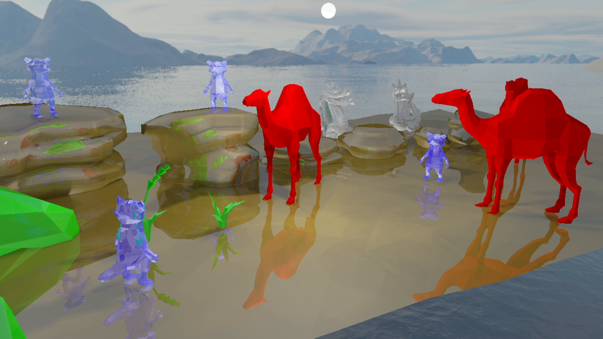
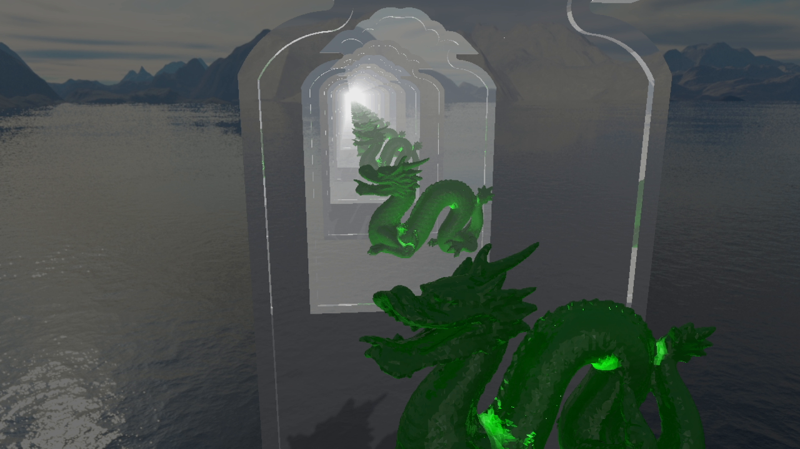

## Ray tracing demo


### Requirements

- C++ 17
- OpenGL 4.3
- Cmake 3.7

### Dependencies

- GLFW
- Glad
- Dear ImGui (glfw-binding, opengl3-binding)
- GLM
- stb_image
- tinyobjloader

### How to build

Use [vcpkg](https://github.com/microsoft/vcpkg) to acquire all dependencies.

```cmd
git clone https://github.com/microsoft/vcpkg
```

Windows:

```cmd
.\vcpkg\bootstrap-vcpkg.bat
```

Linux:

```cmd
./vcpkg/bootstrap-vcpkg.sh
```

Libraries:

```cmd
./vcpkg/vcpkg install glfw3
./vcpkg/vcpkg install glad
./vcpkg/vcpkg install imgui[glfw-binding,opengl3-binding]
./vcpkg/vcpkg install glm
./vcpkg/vcpkg install stb
./vcpkg/vcpkg install tinyobjloader
```

For Windows x64 bit version:

```cmd
./vcpkg/vcpkg install glfw3:x64-windows
./vcpkg/vcpkg install glad:x64-windows
./vcpkg/vcpkg install imgui[glfw-binding,opengl3-binding]:x64-windows
./vcpkg/vcpkg install glm:x64-windows
./vcpkg/vcpkg install stb:x64-windows
./vcpkg/vcpkg install tinyobjloader:x64-windows
```

Set DCMAKE_TOOLCHAIN_FILE according to [vcpkg instruction](https://github.com/microsoft/vcpkg/#using-vcpkg-with-cmake).
Build using Cmake.